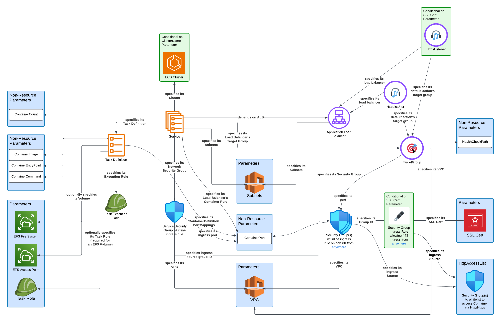

# cinco

Install pyenv, and it should automagically use the python version specified in `.python-version`

Tooling is listed in dev-requirements.txt

## Infrastructure

The Infrastructure directory contains the "cinco" sceptre project and makes use of two tooling libraries listed in dev-requirements.txt:

- sceptre: provides a wrapper around the `aws cloudformation` cli and an added layer of jinja templating ontop of the cloudformation templating. Jinja templating allows for more complex templating options like if statements and for loops wrapped around resources and their properties. More information here: https://docs.sceptre-project.org/latest/
- cfn-lint: a handy linter I use in my vs code setup. I'd like to get this integrated into the pre-commit hook.

### Building Infrastructure

You'll need some environment variables: `cp infrastructure/cinco/env.example infrastructure/cinco/env.local` and modify accordingly.

To launch the full cinco stack, navigate into the sceptre project, source the local environment, and run `sceptre launch`:
```
cd infrastructure/cinco
src env.local
sceptre launch
```

To create or update only a part of the cinco stack, specify which cloudformation stack in the `infrastructure/cinco/config` directory you'd like to launch, relative to the `config` directory, for example:
```
cd infrastructure/cinco
src env.local
sceptre launch admin/app-servers.yaml
```

> Sceptre must be run from the `infrastructure/cinco` directory, and must not include `config` as part of the stack path.

Templates are in `infrastructure/cinco/templates` directory. The ecs-webapp.j2 template is diagramed here:


